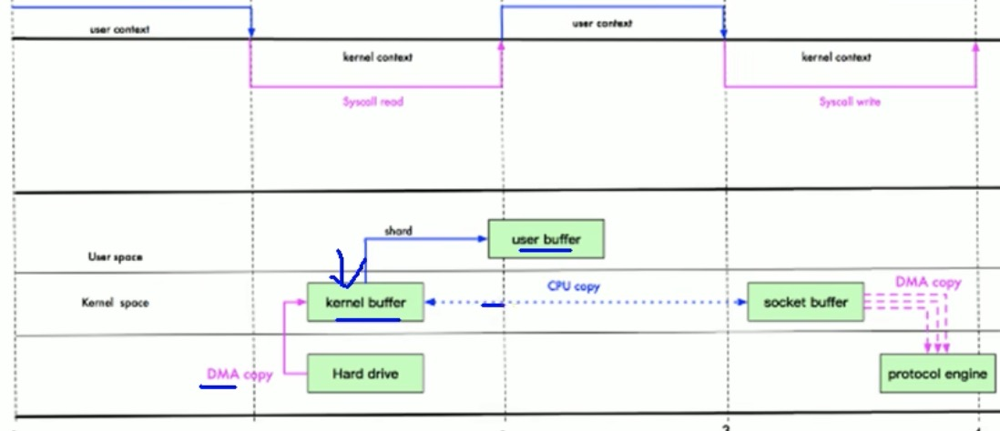
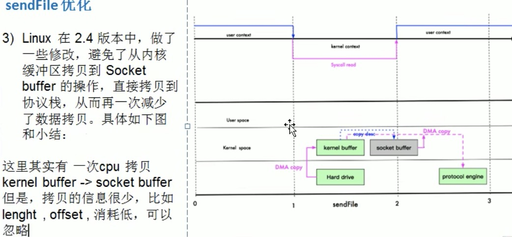
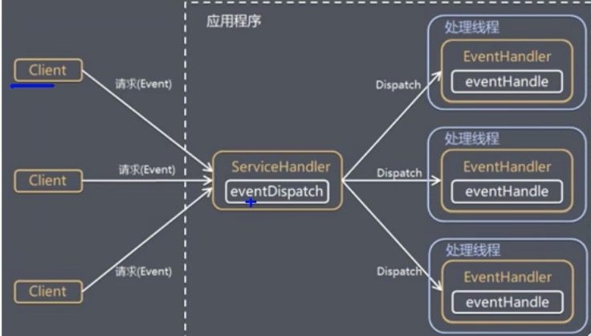
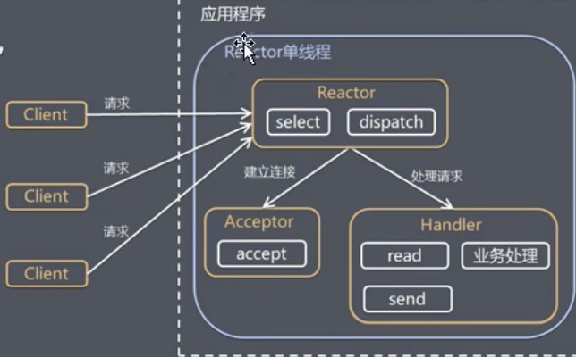
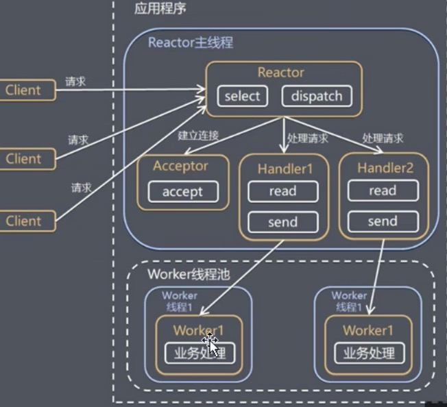

### Netty 重新学习

NIO基本介绍，就是一个主线程通过Selector选择器监听其他多个工作线程的read/accept/write等操作。
netty 类似多个NIO的模型，其中多个主线程就是所谓的WorkerGroup

NIO 三大核心 _`Buffer <- Channel <- Selector`_     
Selector管理多个Channel， Channel 与对应的Buffer一一对应进行管理
数据总是从通道读到缓冲区中，或者从缓冲区写入到通道中，Selector用于监听多个通道的事件，这样单个线程就可以监听到多个客户端通道

####Selector 会根据不同的事件在各个通道上切换  
open() 得到一个选择器  
select(long timeout) 监控所有注册的通道, 当其中有IO操作可以进行时，将对应的SelectionKey加到内部集合中并返回，参数可以用来设置超时事件  
selectedKeys(); //从内部集合中得到所有的SelectionKey

在对于网络IO的过程中，当客户端端连接时，会通过ServerSocketChannel得到SocketChannel,将socketChannel注册到Selector上，register(Selector sel, int pos)一个selector可以注册多个SocketChannel
注册后会返回一个SelectionKey,会和该Selector关联。Selector进行监听select方法，返回有事件发生的通道个数。

####Buffer
Buffer就是一个内存块，底层是一个数组  
数据的读取和写入是通过Buffer，但是需要flip()方法进行读写切换  
mark 是标记 position 下一个要读或写的位置 limit 表示缓冲区的当前终点，不能对缓冲区超过极限的位置进行操作 capacity 表示缓冲区最大容纳数据量  
Buffer在进行put和get时,要按照对应的数据类型和顺序进行操作  
Buffer可以获取只读buffer,循环读取时 可以通过 `buffer.hasRemaining()` 来判断是否还有数据未读取完毕  

####Channel
通道可以同时进行读写，而流只能读或者只能写
通道可以实现异步读写数据
通道可以从缓冲读数据，也可以写数据到缓冲，需要注册到Selector#open()中

`FileChannel` 主要对本地文件进行IO操作  
`read(ByteBuffer dist)` 从通道读取数据并放到缓冲区中
`write(ByteBuffer src)` 把缓冲区的数据写到通道中
`transferFrom(ReadableByteChannel src, long position, long count)` 从目标通道中复制数据到当前通道   
`transferTo(long position, long count, WritableByteChannel target)` 从目标通道中复制数据到当前通道，底层时零拷贝


MapperByteBuffer 可以让文件直接在内存中修改，操作系统不需要拷贝一次  
在利用ByteBuffer数据的形式进行接收数据的时候，channel会按照顺序的方式填充ByteBuffer数组


SelectionKey作用 
绑定了对应的channel(channel())和Buffer(attachment())，同样我们可以查看该key绑定的channel的状态，是否是可读可写和accept的状态


#### 零拷贝基本介绍
传统IO 数据从硬盘经过DMA拷贝到内核Buffer，然后又从内核Buffer中CPU拷贝到用户空间的user buffer，再从用户空间通过CPU拷贝到Socket buffer，最后经过DMA拷贝到协议栈，mmap需要4次上下文切换，3次数据拷贝

mmap
通过内存映射，将文件映射到内核缓冲区，同时用户空间可以共享内核空间的数据，减少了内核空间到用户空间的CPU拷贝
这样在进行网络传输时，就可以减少内核空间到用户空间的拷贝次数


sendFile需要3次上下文切换，最少3次数据拷贝，主要利用DMA方式，减少CPU拷贝
sendFile函数优化，数据根本不经过用户态，直接从内核缓冲区冲入SocketBuffer，同时由于和用户态完全无关，就减少了一次上下文切换  
更少的上下文切换，更少的CPU缓存伪共享以及无CPU校验和计算


####Reactor模式
1）基于IO复用模型，多个连接公用一个阻塞对象，应用程序只需要在一个阻塞对象等待，无需阻塞等待所有连接，当某个连接有新的数据可以处理时，操作系统通知应用程序，线程从阻塞状态返回，开始进行业务处理
2）基于线程池复用线程资源，不必再为每个连接创建线程，将连接完成后的业务处理任务分配给线程进行处理，一个线程可以处理多个连接的业务
图解大致原理


核心组成:  
Reactor: Reactor在一个单独的线程中运行，负责监听和分发事件，分发给适当的处理程序来对IO事件做出反应。
Handlers: 处理程序执行IO事件要完成的实际事件，类似于客户想要与之交谈的公司中的实际官员。Reactor通过调度适当的处理程序来响应IO事件，处理程序执行非阻塞操作。

单Reactor单线程


单Reactor多线程
1. Reactor对象通过select监控客户端请求事件，收到事件后，通过dispatch进行分发。
2. 如果简历连接请求，则由Acceptor通过accept处理连接请求，然后创建一个Handler对象处理完成连接后的各种事件
3. 如果不是连接请求，则由reactor分发调用连接对应的handler来处理
4. handler只负责响应，不做具体的业务处理，通过read读取数据后，会分发给后面的worker线程池的某个线程进行处理业务


主从Reactor多线程  
针对单Reactor多线程模型中，Reactor在单线程中运行，高并发场景下容易称为性能瓶颈，可以让Reactor在多线程中运行

#### Netty模型
1. BossGroup专门负责接收客户端的连接,WorkerGroup负责网络的读写
2. BossGroup和WorkerGroup 都是NIOEventLoopGroup(相当于一个事件循环组，这个组中含有多个事件循环，每个事件循环是NIOEventLoop)
3. NIOEventLoop表示一个不断循环的执行处理任务的线程，每个NIOEventLoop都有一个selector，用于监听绑定在其上的socket的网络通信
4. NioEventLoopGroup可以有多个线程，即可以含有多个NIOEventLoop
5. 每个Boss NIOEventLoop执行的步骤有3步
    - 执行accept事件
    - 处理accept事件，与client建立连接，生成NioSocketChannel，并将其注册到某个worker NIOEventLoop上的selector
    - 处理任务队列的任务 runAllTasks
6. 每个Worker NIOEventLoop循环执行的步骤
    - 轮训read，write事件
    - 处理IO事件，在对应的NIOSocketChannel中处理
    - 处理任务队列的任务 runAllTasks
7. 每个Worker NioEventLoop处理业务时，会使用pipeline，**_pipeline_**中包含了channel，即通过pipeline可以获取对应通道，管道中维护了很多的处理器

TaskQueue模式  
其实每个selector，都绑定了一个TaskQueue，用于异步执行那些耗时比较长操作
```
# 在handler中做如下操作
ctx.channel().eventLoop().execute();
ctx.channel().eventLoop().schedule();
多次提交是taskQueue是线性执行的
```


#### Bootstrap ServerBootStrap
```txt
BootStrap是客户端的启动引导类，ServerBootStrap是服务端启动引导类 
public B channel(Class<? extends C> channelClass) 该方法用来设置服务端或者客户端通道的实现类 
public <T> B option(ChannelOption<T> option, T value)用来给ServerChannel 添加配置
public <T> ServerBootstrap childOption(ChannelOption<T> childOption, T value)  用来给接收到的通道添加配置
public ServerBootstrap childHandler(ChannelHandler childHandler)该方法用来设置业务处理类
public ChannelFuture connect(String inetHost, int inetPort)该方法用于客户端（Bootstrap），用来连接服务器
```

#### Channel
- netty网络通信的组件，能够用于执行网络IO操作
- 通过Channel可获得当前网络连接的通道的状态
- 通过Channel可以获得网络连接的配置参数
- Channel提供异步的网络IO操作（建立连接，读写，绑定端口），异步调用意味着任何IO调用将立即返回，并且不保证调用结束时所请求的IO操作已完成
